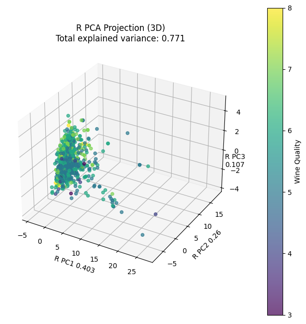
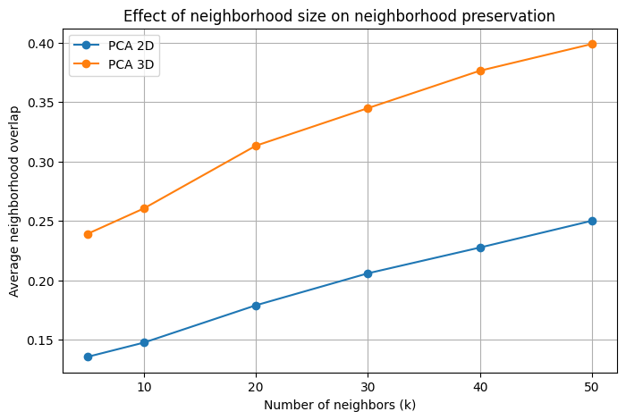
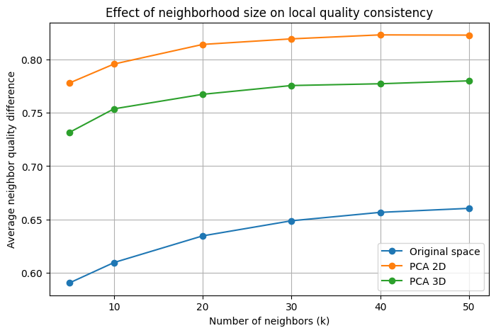

# Intrinsic vs Projected Neighbors

Study of how PCA affects local neighborhood structure in the Wine Quality dataset.

## Motivation

PCA preserves variance, but does it preserve nearest-neighbor relationships?

This project investigates how neighborhood structures change after projecting data into lower-dimensional subspaces.

## Research Questions

- How does PCA affect nearest-neighbor relationships?
- To what extent are k-nearest neighbors preserved?
- What are the implications for distance-based algorithms such as KNN?

## Dataset

Wine Quality Dataset from UCI.

- Samples: 1143
- Features: 12 physicochemical measurements
- Target: Wine quality score

## Methodology

1. Data preprocessing and scaling.
2. PCA projection into 2D and 3D.
3. Computation of k-nearest neighbors.
4. Neighborhood overlap analysis.
5. Quality-consistency analysis.

## Main Results

### PCA Projection

The original 11-dimensional wine dataset was projected into lower-dimensional subspaces using PCA. Although the first principal components retain a large proportion of the total variance, projection inevitably removes information contained in the discarded dimensions.

The 3D projection reveals the dominant geometric structure of the dataset and provides a visual representation of the variance captured by the principal components.

### Neighborhood Preservation

To quantify how PCA affects local geometry, we compared the k-nearest-neighbor sets in the original space with those obtained after projection. Neighborhood preservation was measured using the average neighborhood overlap.

The results show that neighborhood overlap increases with both the number of retained principal components and the neighborhood size \(k\). However, even for larger values of \(k\), the projected spaces do not perfectly reproduce the original local structure. In particular, the 3D projection consistently preserves more neighbors than the 2D projection.

### Quality Consistency

Neighborhood preservation does not necessarily imply preservation of task-relevant information. To investigate this, we measured the average difference in wine quality between each sample and its neighbors.

Although dimensionality reduction alters local neighborhoods, the average quality difference remains relatively stable across projection dimensions. This suggests that PCA can distort geometric relationships while still preserving information associated with wine quality.

### Key Findings

- PCA modifies nearest-neighbor relationships even when a large proportion of variance is retained.
- Increasing the number of principal components improves neighborhood preservation.
- Larger neighborhood sizes lead to higher overlap between original and projected spaces.
- Geometric preservation and quality consistency capture different aspects of the data.
- Despite substantial neighborhood distortion, low-dimensional PCA projections can retain meaningful information related to wine quality.
## Repository Structure

intrinsic-vs-projected-neighbors/
├── data/
├── notebooks/
├── src/
├── figs/
├── results/
└── README.md